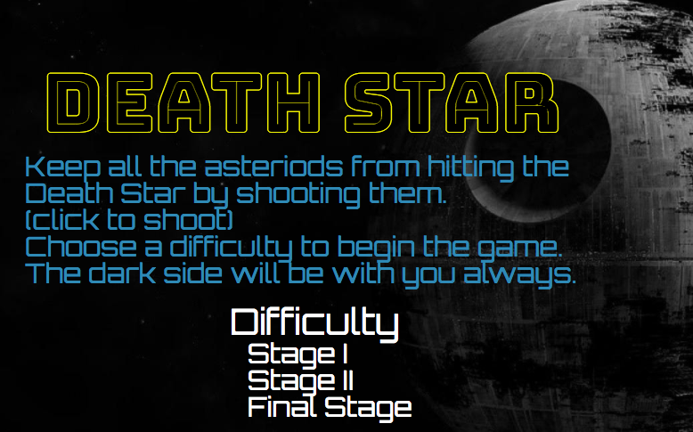

# Death Star

[Death Star live][heroku]

Death Star is a single page browser game inspired by Star Wars movies.
This time, the player will be on the villain side helping to protect the
secret weapon "Death Star". Keep the asteroids from hitting Death Star by
destroying them with your weapon!

[heroku]: https://kobe1104.github.io/Death-Star/

## Features & Implementation

### Game Music and Effect Sounds
  It comes with great background music when the game starts and
  sounds effects when shooting and winning or losing the game.
  Click on the volume icon on the left bottom corner to turn sounds on
  and off!
### Asteroids Come from all Directions

  Watch out! Asteroids come from random directions. Shoot them before they
  hit the Death Star!
### Death Star has Random Path Each Game
  Your Death Star goes in a different path everytime! Each game is unique!
### Restarting Game
  Need to restart or play again? Simply click on the first icon on the left
  bottom corner!

## Future Directions for the Project

### Make More Levels
  Make more interesting levels such as making Death Star invisible and
  only leave the path for harder levels.
### Make Different Weapons
  Allows players get better weapons!
### Upgrade Death Star Picture
  Actually use the Death Star picture for it.
