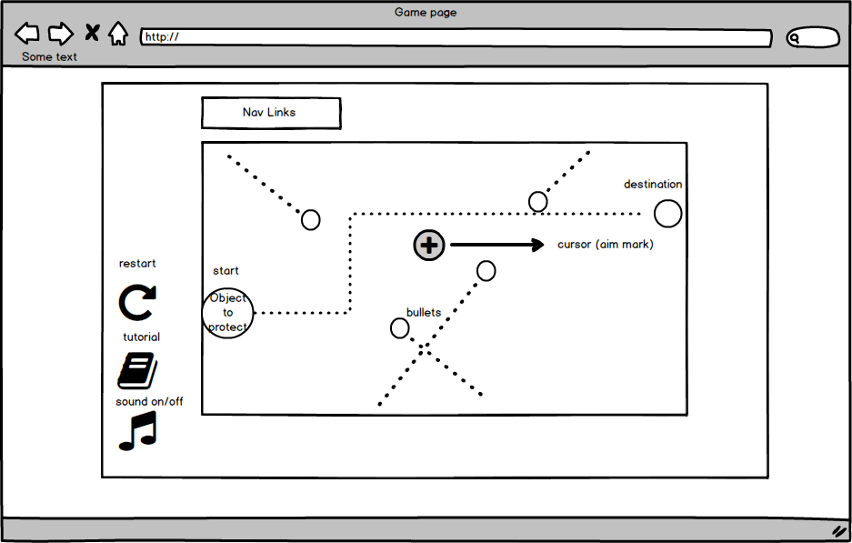

### Background
  Protect the planet is a first person shooting game. The goal is to
  protect the planet from being hit by the meteors coming from
  all directions while it is moving from start to the end. There are
  three levels with different difficulties:
    - First level: The path of the planet is given.
    - Second level: The path is taken away. The planet moves more unpredictably.
    - Third level: The path is given, but the planet itself is invisible.

### Functionality & MVP  

- [ ] Restart and turn music on and off.
- [ ] Protecting planet moves from start to end.
- [ ] Meteors coming from random directions.
- [ ] Shooting on Meteors destroys them.

In addition, this project will include:

- [ ] A game tutorial with rules and pictures.

### Wireframes

This app will consist of a single screen with the game, a link bar that
navigates user to my Github and LinkedIn, a modal tutorial screen.
There are three buttons on the left bottom corner. One let user turn on
and off the music and sound effect; the other one allows user to restart
the game at any point of the game. The last one leads to the tutorial
screen.

### Architecture and Technologies

This project will be implemented with the following technologies:

- Java Script and JQuery for the game logic.
- HTML 5 Canvas for DOM animation and effects.
- CSS for pop up window and styling.
- Webpack for bundling the scripts.

In addition to the webpack entry file, the following scripts will be involved
in this project:

`game.js` handles the logic and rendering the game. It stores a canvas context.
`meteors.js` will handle the logic of how meteors move, where they spawn and other behaviors.
`planet.js` will handle the movement speed, path and also visibility of the planet.

### Implementation Timeline

**Day 1**: Setup webpack.config.js and package.json bundlers and create the skeleton of
`game.js`, `meteors.js` and `planet.js`. Work on rendering part of `game.js`.
Learn how to use canvas to make moving objects and effects.
Goals:
  - Build rendering part of the script.
  - Shows simple objects on canvas.

**Day 2**: Build `meteors.js` and connect it to `game.js`. Expect to render moving meteors
on canvas.
Goals:
  - Finish `meteors.js`.
  - Generate and make each meteors moving in straight lines.

**Day 3**: Build `planet.js` and connect it to `game.js`. Expect to render planet on canvas.
Make tutorial modal.
Goals:
  - Finish `planet.js`.
  - Generate a planet instance and have it moving in canvas.
  - Have tutorial modal working.

**Day 4**: Finish up `game.js`. Make sure both meteors and planet render on canvas.
Goals:
  - Finish `game.js` and make sure it is playable.
  - Make restart button.
  - Make sound on/off button.

### Bonus features

- [ ] Add more difficult levels.
- [ ] Add more weapons.
- [ ] Change the protecting object to actual Death Star picture.
